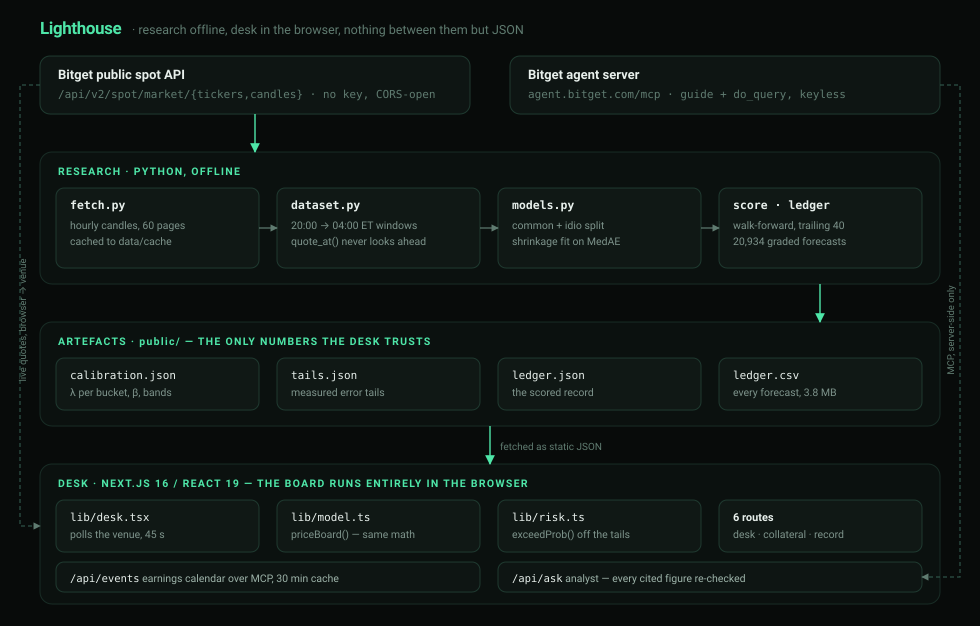

# Lighthouse

**A validated reference price for US equities while their home market is dark.**

Bitget's rTokens are tokenized US equities that trade around the clock. While NYSE and Nasdaq are open, orders route there and the price is real. Between **20:00 and 04:00 ET** they are not: Bitget states plainly that these are *indicative quotes, not live Nasdaq or NYSE transaction prices*. They come from internal matching and market-maker inventory — and rTokens are accepted as Unified Trading Account collateral at ratios up to **95%**, so positions are marked, and liquidated, against a number nobody validates.

Lighthouse estimates what each name is actually worth during those eight hours, grades that estimate against the 04:00 reopen that follows, and publishes every single forecast it has ever made.

**Live desk:** https://lighthouse-desk.vercel.app
**Built for:** [Bitget AI Base Camp Hackathon S2](https://bitget-ai.gitbook.io/bitgetai_hackathons2) — AI Trading Desk, Decision Stress Testing
**The record:** 20,934 graded forecasts, 47 names, 142 overnight windows, `2025-11-19 → 2026-09-16`

---

## Features

### Core Capabilities

- **Cross-sectional fair value** — Each name's dark-hours move is split into a **common component** (its loading on a factor built from the whole universe) and a **name-specific residual**, then each is shrunk by how much history says survives to the reopen.
- **Calibrated by hour of the night** — Shrinkage is fitted separately for five slices of the window. Both weights are free to collapse to zero, in which case the answer is simply "the last close" — which is the correct answer at 22:00 ET.
- **Walk-forward, always** — Weights are refitted on the trailing 40 closed windows. No forecast is ever produced with knowledge of its own answer, and `tests/test_core.py` enforces it.
- **Measured uncertainty, not assumed** — Error tails are empirical, read off the graded ledger at fifteen grid points, per horizon and per name. Nothing is assumed normal.
- **An auditable ledger** — All 20,934 forecasts ship in [`data/ledger.csv`](data/ledger.csv): window, timestamp, symbol, the venue quote, the fair value, the realised reopen, and the error of all three models.
- **Live earnings calendar over MCP** — Read from Bitget's own agent server, keyless, with the tool catalogue discovered at runtime. A wide quote the night before a report is news arriving, not a stale mark, and the desk says so.
- **Grounded analyst** — Every figure the model cites is re-checked against the desk state before it reaches the reader. Invented numbers are dropped, and the count of dropped claims is reported.

### The Desk

- **Live board** — 47 names re-priced from Bitget every 45 seconds, entirely in the browser. Deviation from fair value, graded against the band measured for this hour of the night.
- **Collateral mirage** — Enter a book and a debt, and see the gap between the cushion your screen shows and the cushion you actually have, in dollars, with the measured probability the reopen eats it.
- **The record** — The full scorecard by horizon and by name, including the names Lighthouse makes *worse*.
- **Research** — Ask the desk a question in plain language; answers come back with cited evidence.
- **WebGL hero** — A GPU scan-field over the landing page, built with three.js and postprocessing.

---

## Architecture

<p align="center">
  
</p>

Lighthouse is three layers with a deliberately thin seam between them: **the research produces JSON, the desk consumes JSON, and nothing else passes between them.**

### Layer 1: Research (Python, offline)

Run once, by hand. Fetches hourly candles for the rToken universe, builds dark windows, fits the model walk-forward and scores it:

- `dataset.py` owns the **20:00 → 04:00 ET** boundary and the no-lookahead guarantee (`quote_at()` refuses any bar at or after the timestamp it is asked about, and refuses stale quotes).
- `models.py` holds four estimators behind one interface: `LastClose`, `NaiveQuote`, `Lighthouse`, `LighthouseCalibrated`.
- `score.py` runs the walk-forward harness; `ledger.py` writes every prediction out row by row.

### Layer 2: Calibration artefacts (JSON, committed)

Four files in `public/` are the entire contract between research and desk. If the desk shows a number, it came from one of these:

| File | Holds |
|------|-------|
| `calibration.json` | λ per bucket, per-symbol β, tolerance bands, overshoot ratios, weekend statistics |
| `tails.json` | Empirical error tails on a 15-point grid — by horizon, by window kind, by symbol |
| `ledger.json` | The scored record: totals by horizon, and per-symbol performance |
| `ledger.csv` | Every one of the 20,934 forecasts, 3.8 MB |

### Layer 3: Desk (Next.js, browser)

`lib/model.ts` re-implements `priceBoard()` — the same decomposition, in TypeScript — and calls Bitget's endpoints directly from the page. Bitget serves `access-control-allow-origin: *`, so **the live board has no backend at all**: there is no server of ours between you and the venue, and nothing to trust.

Two server routes exist, and the desk degrades cleanly without either:

- `app/api/events` speaks MCP to Bitget's agent server for the earnings calendar.
- `app/api/ask` proxies one model call, and never sees your key.

### Data Flow

```
Research (offline)                         Desk (browser, live)
      │                                            │
      ├─ fetch.py ── hourly candles ──► data/cache │
      ├─ build_windows() ── 20:00→04:00 ET         │
      ├─ walk-forward: fit on trailing 40          │
      │    └─ predict window N+1, never N          │
      ├─ ledger.py ── grade vs 04:00 reopen        │
      ├─ export_calibration.py                     │
      │        │                                   │
      │        └─► public/*.json ─────────────────►├─ load calibration + tails + ledger
      │                                            ├─ darkWindow(now) → elapsed → bucket
      │                                            ├─ GET /api/v2/spot/market/tickers
      │                                            ├─ GET .../candles → anchor = 19:00 close
      │                                            ├─ factor = median(quote returns)
      │                                            ├─ fair = anchor · (1 + λc·βf + λi·idio)
      │                                            ├─ dev = (quote − fair)/fair, in bps
      │                                            └─ wide if |dev| > band[bucket]
      │                                                      │
      │                                   /api/events ◄──────┤ earnings, MCP
      │                                   /api/ask    ◄──────┘ analyst, cited
```

---

## The Model

### Decomposition

Every model answers one question: *given what is observable at time T inside a dark window, what will this name print when the session reopens?* Predictions are returns from the last regular-session close.

```
factor  =  median over the universe of ( quote_i / anchor_i − 1 )     # robust, not a mean
common  =  β_i · factor                                               # this name's loading
idio    =  ( quote_i / anchor_i − 1 )  −  common                      # what's left

fair_i  =  anchor_i · ( 1  +  λ_common · common  +  λ_idio · idio )
```

The median, not the mean: individual rToken quotes during dark hours are sparse and noisy, and a handful of stale or stub quotes would drag a mean.

`anchor` is the close of the **19:00 ET bar** — the last print of the 20:00 post-market close. Ground truth is the **04:00 ET** pre-market reopen.

### The trust curve

λ is fitted per slice of the night by coordinate descent on median absolute error, seeded from least squares. Read it as: *trust this share of what the venue is showing you, at this hour.*

| Through the window | ≈ ET | λ common | λ idio | Tolerance band |
|---|---|---|---|---|
| 0 – 35% | 20:00 – 22:48 | 0.85 | 0.40 | ±30.0 bps |
| 35 – 60% | 22:48 – 00:48 | 0.70 | 0.40 | ±28.8 bps |
| 60 – 80% | 00:48 – 02:24 | 0.90 | 0.65 | ±24.1 bps |
| 80 – 92% | 02:24 – 03:22 | 0.85 | 0.65 | ±23.0 bps |
| 92 – 100% | 03:22 – 04:00 | 1.00 | 0.90 | ±18.5 bps |

Both weights rise toward the reopen, and the band tightens. That shape is the finding: **the venue's quote becomes informative only as the morning approaches.**

These are the frozen weights the desk ships in `calibration.json`. The scored record does not use them — walk-forward refits λ on every window, and its rolling average at the 25% horizon is a more cautious `[0.64, 0.47]`.

### Walk-forward protocol

| Step | Rule |
|------|------|
| Fit window | Trailing **40 closed** dark windows |
| Predict | Window N+1 only, never N |
| Refit | Every window, rolling |
| Ground truth | The 04:00 ET reopen print |
| Enforcement | `test_never_trains_on_the_row_it_scores` |

A fixed train/test split was tried first and rejected — see below.

---

## The Record

Ground truth is the 04:00 ET pre-market reopen. Median absolute error, in basis points. Lower is better.

| Into the dark window | Assume close held | Venue quote | Lighthouse | Beats venue | Forecasts |
|---|---|---|---|---|---|
| 25% (~22:00 ET) | 32.5 | 33.4 (+3%) | **29.1 (−11%)** | 55.2% | 5,214 |
| 50% (~00:00 ET) | 32.4 | 30.7 (−5%) | **26.3 (−19%)** | 56.5% | 5,234 |
| 75% (~02:00 ET) | 32.3 | 25.1 (−22%) | **22.6 (−30%)** | 56.2% | 5,243 |
| 90% (~03:12 ET) | 32.3 | 19.8 (−39%) | **19.4 (−40%)** | 53.5% | 5,243 |

Lighthouse beats "assume nothing happened" at every horizon, and the raw venue quote on 53.5–56.5% of individual forecasts — a real edge, but a thin one.

**Every row is in [`data/ledger.csv`](data/ledger.csv).** Recompute it yourself; nothing is taken on trust.

### Where it helps, and where it doesn't

The model earns its keep where there is something to explain. On quiet mega-caps it is a rounding error either way, and occasionally slightly worse. Both ends shown:

| Instrument | Typical reopen move | Assume close held | Lighthouse | Change |
|---|---|---|---|---|
| LITE | 97 bps | 97.0 | 42.1 | **−57%** |
| MU | 107 bps | 107.0 | 52.0 | **−51%** |
| TQQQ | 85 bps | 85.3 | 47.3 | **−45%** |
| COHR | 137 bps | 137.2 | 80.3 | **−42%** |
| JPM | 6 bps | 6.1 | 6.5 | +7% |
| AXP | 7 bps | 6.9 | 7.6 | +10% |
| EWZ | 8 bps | 8.4 | 11.4 | +36% |

13 further names were dropped as **stale** — their price is identical at the close and the reopen, so there is nothing to price and any ratio against them is meaningless.

### What the data said that we did not expect

Three findings that contradicted the original thesis and were kept:

1. **The dark window is not what it looks like.** US extended-hours sessions run 04:00–20:00 ET, so the genuinely dark stretch is **20:00 → 04:00**, not 16:00 → 09:30. Measured on the wrong window, every error figure roughly triples and the conclusions invert.

2. **The relationship is non-stationary.** A fixed train/test split produced weights that actively hurt out of sample: across the split the dead zone grew quieter and the quote's correlation with the realised reopen move fell to **+0.15**. This is why calibration rolls rather than sits still.

3. **Early in the night, the venue's quote is worse than useless.** Measured at ~22:00 ET it carries *more* error than assuming the last close held — 33.4 bps against 32.5. And it never stops overshooting: by 03:12 the quote has moved a median **46.4 bps** while the reopen only moves **33.5**, a ratio of **1.39×**. The venue consistently reprices further than the repricing that actually sticks.

### Weekends

Weekend repricing is far larger: median **70 bps** from Friday's close to Monday's reopen, 90th percentile **299 bps**, and **19%** exceed 200 bps — against collateral accepted at up to 95%.

Weekend windows are **reported but not fitted**. There are only 31 of them, and weekend quoting on Bitget only became near-continuous in August 2026 (2–10% of weekend hours quoted Jan–May, 32% in June, 52% in July, 93% in August). Fitting on that would be dressing up noise.

---

## Technology Stack

**Research:**
- Python 3.13 + NumPy
- pytest (15 tests, including the no-lookahead guarantee)
- No pandas, no sklearn — the estimators are ~300 lines and are meant to be read

**Desk:**
- Next.js 16.3.5 (App Router, Turbopack) + React 19
- TypeScript 5.7 (strict)
- Tailwind CSS v4 (`@theme` tokens, no config file)
- Framer Motion (page and element choreography)
- three.js + postprocessing (the WebGL scan-field hero)
- lightweight-charts (candlesticks)
- lucide-react (icons)

**Integrations:**
- Bitget public spot v2 REST — keyless, CORS-open, called from the browser
- Bitget agent server over **MCP** (streamable HTTP, JSON + SSE) — server-side only
- Any OpenAI-compatible chat endpoint for the analyst

---

## Getting Started

### Prerequisites

- **Node.js 20+** and **pnpm**
- **Python 3.11+** (only if you want to rebuild the research; the committed JSON is enough to run the desk)
- No Bitget account, no API key, no signing — every endpoint used is public and read-only

### Installation

**1. Clone the repository:**
```bash
git clone https://github.com/martinvibes/lighthouse.git
cd lighthouse
```

**2. Install the desk:**
```bash
pnpm install
```

**3. Install the research toolchain (optional):**
```bash
python3 -m venv .venv
.venv/bin/pip install -r requirements.txt
```

### Environment Setup

The desk needs **no environment variables to run**. The board, the collateral tool and the record all work with nothing configured.

One optional variable enables the research analyst on `/research`:

```bash
# .env.local  — never commit this
OPENAI_API_KEY=sk-...
```

Any OpenAI-compatible endpoint works. To point somewhere else:

| Variable | Default | Purpose |
|----------|---------|---------|
| `OPENAI_API_KEY` | — | Key for the analyst. Also accepted as `LLM_API_KEY` |
| `LLM_BASE_URL` | `https://api.openai.com/v1` | Any OpenAI-compatible base URL |
| `LLM_MODEL` | `gpt-4o` | Model name |
| `BITGET_MCP_URL` | `https://agent.bitget.com/mcp` | Bitget's agent server |

Without a key, `/api/ask` returns a clear 503 and **the rest of the desk is unaffected**.

### Running the desk

```bash
pnpm dev        # http://localhost:3000
pnpm build      # production build
pnpm typecheck  # tsc --noEmit
```

### Running the research

```bash
.venv/bin/python scripts/fetch.py 60 22          # cache hourly candles for 60 rTokens
.venv/bin/python scripts/build_ledger.py         # rebuild the full prediction ledger
.venv/bin/python scripts/export_calibration.py   # refresh the desk's calibration + tails
.venv/bin/python scripts/walkforward.py          # print the record
.venv/bin/python scripts/experiment.py           # compare all models at every horizon
.venv/bin/python -m pytest tests/ -q             # 15 tests
```

---

## Project Structure

```
lighthouse/
├── lighthouse/                        # the research library
│   ├── bitget.py                      # public API client (no key, no signing)
│   ├── universe.py                    # rToken selection by 24h turnover
│   ├── dataset.py                     # ⭐ the 20:00→04:00 boundary + no-lookahead quote_at()
│   ├── models.py                      # LastClose · NaiveQuote · Lighthouse · LighthouseCalibrated
│   ├── score.py                       # walk-forward harness
│   └── ledger.py                      # the auditable prediction ledger
│
├── scripts/
│   ├── fetch.py                       # cache hourly candles
│   ├── build_ledger.py                # rebuild data/ledger.csv
│   ├── export_calibration.py          # freeze the fit into public/*.json
│   ├── walkforward.py                 # print the record
│   └── experiment.py                  # model comparison at every horizon
│
├── tests/
│   └── test_core.py                   # 15 tests — window boundary, staleness, no-lookahead
│
├── app/                               # Next.js App Router
│   ├── page.tsx                       # landing
│   ├── desk/page.tsx                  # the live board
│   ├── collateral/page.tsx            # the collateral mirage calculator
│   ├── research/page.tsx              # the analyst
│   ├── record/page.tsx                # the full scorecard
│   ├── docs/page.tsx                  # method
│   ├── api/events/route.ts            # earnings calendar over MCP
│   └── api/ask/route.ts               # analyst proxy, cited-figure filter
│
├── components/
│   ├── Landing.tsx                    # hero
│   ├── GridScan.tsx                   # WebGL scan-field (three.js + postprocessing)
│   ├── Board.tsx                      # the 47-name table
│   ├── Instrument.tsx  Chart.tsx      # per-name detail + candlesticks
│   ├── Verdict.tsx                    # one name, one judgement
│   └── Nav.tsx  Logo.tsx  Ambient.tsx
│
├── lib/
│   ├── time.ts                        # ⭐ darkWindow() — DST-safe ET arithmetic
│   ├── bitget.ts                      # browser client + bounded-concurrency pool()
│   ├── model.ts                       # priceBoard() — the same math in TypeScript
│   ├── risk.ts                        # exceedProb() over measured tails
│   ├── mcp.ts                         # minimal MCP client, schema-driven arguments
│   ├── state.ts                       # desk → analyst context
│   └── desk.tsx                       # the live provider, 45 s poll
│
├── public/
│   ├── calibration.json               # λ, β, bands, overshoot, weekend stats
│   ├── tails.json                     # measured error tails
│   ├── ledger.json                    # the scored record
│   └── ledger.csv                     # every forecast
│
└── data/ledger.csv                    # the same ledger, at the repo root for review
```

---

## Routes

| Route | Page | Description |
|-------|------|-------------|
| `/` | Overview | The thesis, the record, a live preview of the board |
| `/desk` | Desk | 47 names re-priced live; deviation vs the band for this hour |
| `/collateral` | Collateral | What your margin cushion is really worth before the reopen |
| `/research` | Research | Ask the desk a question; answers come back with cited evidence |
| `/record` | Record | The full scorecard by horizon and by name, including the losses |
| `/docs` | Docs | Method, boundaries, and limits |

---

## API Reference

Both routes are server-side. The board does not use either — it degrades to a quiet state if they fail.

### `GET /api/events`

The earnings calendar for every US name, read from Bitget's agent server over MCP. Cached 30 minutes.

Nothing about the server's tools is hardcoded. The route calls `tools/list`, reads the catalogue with `guide({category:"equity"})`, confirms the earnings entry still exists, and builds each call's arguments from that tool's declared `inputSchema` — so a renamed parameter degrades to "no data" rather than to a wrong request.

```json
{
  "ok": true,
  "endpoint": "https://agent.bitget.com/mcp",
  "tool": "do_query",
  "entry": "equity_calendar_earnings",
  "n_rows": 4744,
  "n_names": 4744,
  "calendar": {
    "AAPL": { "symbol": "AAPL", "date": "2026-10-30", "days": 38, "eps": 1.74 }
  }
}
```

On failure it returns `{ ok: false, reason, endpoint }` — never an exception.

> **One gotcha worth recording:** the catalogue caps a reply at 1500 rows and *silently truncates* a wide date range. AAPL fell off a 70-day pull while still resolving in a single-symbol call. The route asks a week at a time, ten weeks in parallel.

### `POST /api/ask`

One model call against the desk state the page sends, and nothing else.

| Field | Type | Description |
|-------|------|-------------|
| `question` | `string` | Max 600 chars |
| `state` | `string` | The desk context, max 24,000 chars |

**Response:**

```json
{
  "verdict": "LITE is +84 bps rich against a ±23 bps band — the widest on the board.",
  "text": "Three to five sentences of plain prose...",
  "evidence": [{ "label": "deviation", "value": "+84 bps" }],
  "watch": "One sentence naming what would change this read.",
  "dropped": 1,
  "model": "gpt-4o"
}
```

**The cited-figure filter is the point.** Before an answer is returned, every `evidence` entry has its numeric core extracted and checked against the state verbatim. Anything the model invented is dropped, and `dropped` reports how many. A figure the model made up is a figure the reader never sees.

---

## How It Works

### 1. The window is established

`darkWindow(now)` walks back to the most recent weekday 20:00 ET, skipping weekends, and forward to the next 04:00 ET. It converges through DST rather than assuming a fixed offset. `elapsed` is the fraction of the night that has passed; it selects the calibration bucket.

### 2. The anchor is found

For each name, the close of the **19:00 ET bar** at or before the window start. That is the last print before US venues shut, and every return in the system is measured from it.

### 3. The cross-section is built

All 47 quote returns are collected and the **median** taken. That is the factor — the part of tonight's move that is happening to everything at once.

### 4. Each name is decomposed and shrunk

`common = β · factor`, `idio = quoteRet − common`, then both are multiplied by the λ fitted for this bucket. A name whose entire move is the factor gets `λ_common` applied; a name moving alone gets the much harsher `λ_idio`.

### 5. The deviation is graded

`dev = (quote − fair) / fair` in basis points, compared against the tolerance band measured for this hour. Wide means *this quote is further from fair value than we normally miss by*, not *this is wrong*.

### 6. The earnings calendar overrides the read

If the name reports within two days, the desk stops calling a wide quote a mirage. A gap that size before a report is news arriving — it should be read as real.

### 7. Everything is scored, later

When the reopen prints, the row is graded against all three models and appended to the ledger. The next refit sees it. The forecast never did.

---

## Limits

- **The model is a measurement, not a signal.** It says what a fair price looks like given the cross-section. It never says buy or sell, and the analyst is instructed to refuse to.
- **Hourly bars, not ticks.** Anything that opens and closes inside an hour is invisible.
- **47 names.** The universe is the most-traded rTokens by 24h turnover; thin names are excluded because their quotes are stale rather than informative.
- **Stale names are dropped, not scored.** 13 names whose close and reopen are identical were removed — there is nothing to price, and any improvement ratio against them is meaningless.
- **The weekend is reported, not fitted.** 31 windows with quoting coverage that only stabilised in August 2026.
- **The MCP calendar is best-effort.** If Bitget's agent server is unreachable the desk says so on the strip and continues. The measured record never depends on it.
- **Nothing here is advice**, and no claim is made that the venue's quote is wrong — only that it is further from the reopen than the alternative, by this much, this often.

---

## Built With

- [Bitget API](https://www.bitget.com/api-doc/common/intro) — public spot v2, keyless and CORS-open
- [Model Context Protocol](https://modelcontextprotocol.io) — how the desk reaches Bitget's agent server
- [Next.js](https://nextjs.org) — App Router, Turbopack
- [React](https://react.dev) 19
- [Tailwind CSS](https://tailwindcss.com) v4
- [Framer Motion](https://motion.dev) — choreography
- [three.js](https://threejs.org) + [postprocessing](https://github.com/pmndrs/postprocessing) — the WebGL hero
- [Lightweight Charts](https://tradingview.github.io/lightweight-charts/) — candlesticks
- [NumPy](https://numpy.org) — the fit
- [pytest](https://pytest.org) — the guarantees

## Author

- [**martinvibes**](https://github.com/martinvibes) — research, model, desk

